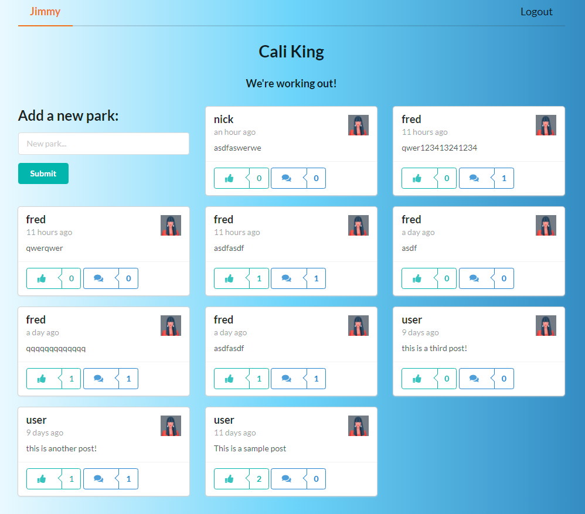
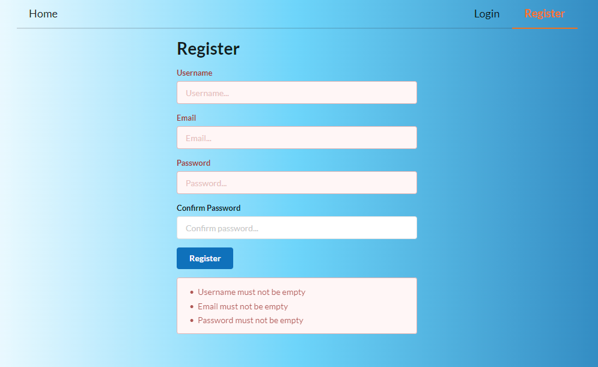

# Cali-King
### Hold Dat!

A website to find, share, like and comment on local outdoor workout exercise parks, and participate in Calisthenics for good health.

## Table of Contents
- [Links](#links)
- [What is Calisthenics?](#what-is-calisthenics)
- [Cali-King Application](#cali-king-application)
- [Features](#features)
- [Instructions for Use](#instructions-for-use)
- [Approach and Result](#approach-and-result)
- [Technologies Used](#technologies-used)
- [Screenshots](#screenshots)

## Links

Link to the deployed application: https://cali-king.netlify.app/

Link to the deployed back-end: https://ghastly-shadow-54051.herokuapp.com/

Link to the code repository: https://github.com/raven-bootcamp/cali-king

## What is Calisthenics?
Calisthenics are exercises that don't rely on anything but a person's own body weight. These exercises are performed with differing levels of intensity and rhythm. ... These exercises allow for the development of strength, endurance, flexibility, and coordination.

Often, calisthenics workouts are done outdoors, using a pull-up bar or other similar outdoor equipment.

## Cali-King Application

Cali-King is designed to bring Calisthenics enthusiasts and beginners alike together for glorious workouts and fitness.

It's easy to find an indoor gym, they're everywhere.  But it's difficult to find a nearby park with good quality exercise equipment.  A Google search might help with a bit of luck, but often disappointment is the result when you find out that a lot of exercise equipment is designed for children or people up to a certain height and weight.

Cali-King allows anyone to easily find a well-rated park nearby that will fit their workout needs.

### Features
- Add a new profile for a cali-park you have been to, or that you know of
- Add photographs of the equipment
- Add equipment characteristics (such as suitable person height, weight, skill level)
- Like and comment on other park profiles
- Order profiles by hightest rating (still in development)

## Instructions for Use
It is assumed that you have checked out the repository to your local machine, using Git.

Firstly, from the base directory, install the required node libraries:
```
npm install
```
Installing the libraries may take a few minutes.

Once installation is finished, open a second terminal window and install the client-side libraries:
```
# change into the client directory:
cd client

# install the libraries:
npm install
```
It is assumed you have set up a MongoDB database for local use, stored in a `.env` file. 

Once completed, keep both terminal windows open (one in the base directory, one in the client directory).In the first terminal window, start the server with the following command: 
```
node index.js
```
Once the server is running, in your second window you can use the following command to run the application (it should open automatically in your web browser):
```
npm run start
```
## Approach and Result
For this application, I deployed the server using Heroku (see Links section above) separately to the front-end.

The front-end is deployed using Netlify.  This is as a result of multiple configuration issues I had with Heroku that I am still attempting to resolve.

Several features were within scope originally, but did not make the deadline.  They are:
- photo uploads
- rich profile data
- Google Maps functionality

## Technologies Used
- [Atlas: MongoDB cloud](https://www.mongodb.com/cloud/atlas/register) - I used this from the start when building the backend, which allowed me to add to the data over time
- [Apollo Server](https://www.apollographql.com/docs/apollo-server/getting-started/) - this handles GraphQL and also uses Express JS under the hood, therefore meeting the Express requirement of the project
- [Mongoose](https://mongoosejs.com/) - mongoDB object modeling for node js
- [React](https://reactjs.org/) - a Javascript library for building front-end user interfaces
- [React-Router](https://reactrouter.com/web/guides/quick-start) - declarative routing for React

## Screenshots



